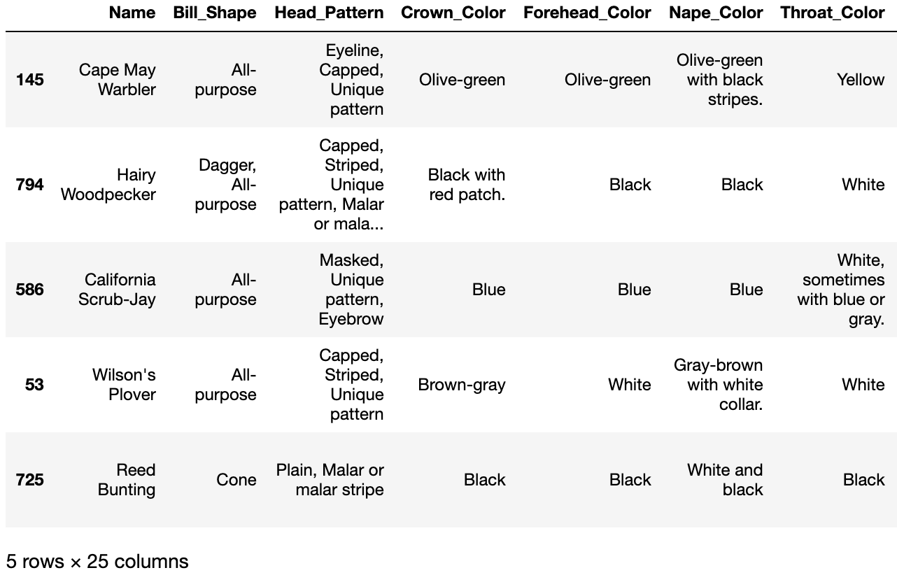
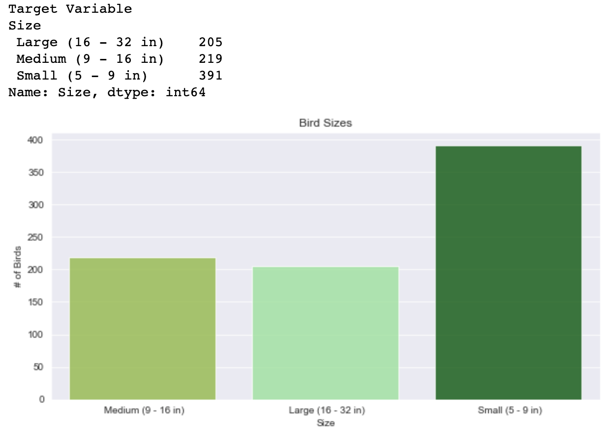
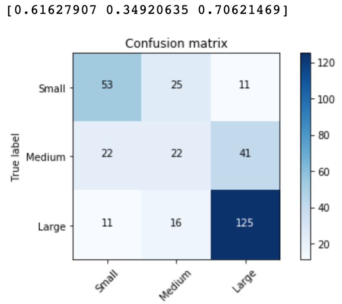
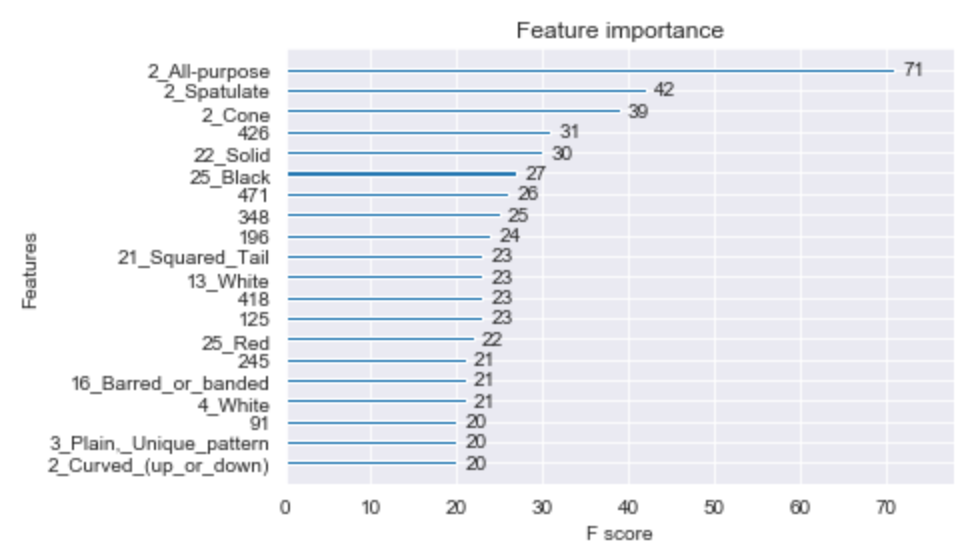

# Bird-Classifier-Project
Using machine learning models and Natural Language Processing to predict whether a bird is small, medium, or large

# Project Goal
In order to exercise my understanding and implementation of various machine learning models, I sought out a dataset on about 1000 different species of bird with the intention of classifying the size of the bird based on other not-so-obvious features (e.g., the color of their crown or the patterns of their feathers). The project also expands to include a *Bag of Words*, an NLP model which is basically count-vectorization.

# The Data

Using Selenium, I webscraped [this bird guide website](https://www.whatbird.com/) with tons of data about birds, organizing it into a DataFrame like so:

# The Models

After training a couple vanilla classifier models(decision tree, bagged tree, random forest), I began using GridSearch and RandomizedSearch to optimize hyperparamaters.

## Handling Imbalanced Classes with SMOTE

As you can tell from the image above, there is a heavy class imbalance among the data. In order to counter this, I employ SMOTE(Synthetic Minority Over-sampling Technique), creating fake datapoints to fill out the smaller classes.

## Random Forest

The three numbers above the confusion matrix represent the accuracy of the model's validation predictions for each class (Small, Medium, or Large bird).

## Bag of Words

So far, models were trained on the features shown above in the dataframe alone. However, one of the features was the bird's *flight pattern*, a brief sentence or two describing how the bird flies. I took this interesting opportunity to use SKLearn's CountVectorizer, creating a "bag of words" of the flight patterns of the birds. Augmenting this as a separate feature to the Random Forest model increased its accuracy to **~68%**!

This brings us to my best model...

## Support Vector Classifier

Once again including the Bag of Words as a feature to this SVC model(after using RandomizedSearch for hyperparameter tuning) yielded a test accuracy of **~71%**.

***The following are additional methods that were attempted but did not provide results as favorable as the model above.***

## Boosting methods

AdaBoost and XGBoost came close, with XGBoost yielding ~70% accuracy. The model however proved useful in showing different feature importances(the most predictive feature, in this case, being an "all-purpose" beak): 

# Thank you

I very much enjoyed this project, and welcome any feedback! Feel free to reach out to me with any questions, comments, thoughts, or additions you might have made. Thanks!

